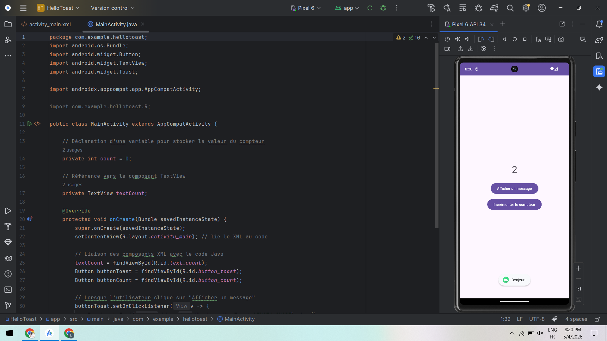
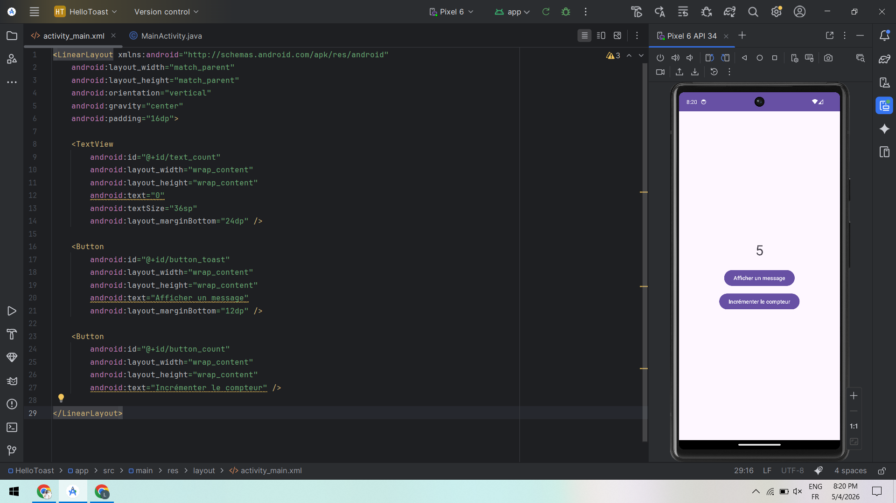

# 📱 HelloToast - Lab Android

## 📌 Description
Dans ce lab, j’ai créé une application Android simple qui permet :
- d’afficher un message (Toast)
- d’incrémenter un compteur affiché à l’écran

---

## 📸 Capture 1 — Interface XML (activity_main.xml)

✅ Cette capture montre la création de l’interface graphique en XML :
- Un **TextView** pour afficher le compteur
- Deux **Button** :
  - Afficher un message
  - Incrémenter le compteur
- Utilisation de **LinearLayout** avec centrage des éléments

---

## 📸 Capture 2 — Code Java (MainActivity.java)

✅ Cette capture montre la logique de l’application en Java :
- Initialisation des composants avec `findViewById`
- Gestion des clics avec `setOnClickListener`
- Affichage d’un **Toast** (message)
- Incrémentation du compteur et mise à jour du TextView

---

## ✅ Résultat
- L’application fonctionne correctement
- Le compteur s’incrémente à chaque clic
- Un message s’affiche lorsque l’utilisateur appuie sur le bouton

---
